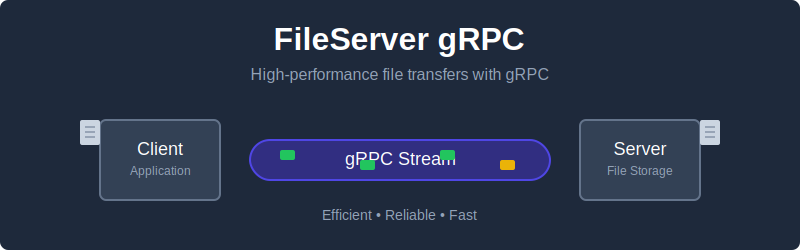

# FileServer gRPC

A modern, high-performance file server implementation using gRPC technology.



## 🚀 Overview

FileServer gRPC provides a robust, efficient way to serve files over the network using Google's gRPC protocol. This implementation offers significant performance advantages over traditional HTTP file servers, with streaming capabilities, strong typing, and better compression.

## ✨ Features

- **High-performance** file transfers using gRPC streaming
- **Bidirectional streaming** support for advanced file operations
- **Strong typing** through Protocol Buffers
- **Cross-platform compatibility** - works on Linux, macOS, and Windows
- **Simple, intuitive API** for file operations
- **Highly efficient** network utilization

## 🛠️ Installation

### Prerequisites

- Go 1.20 or higher
- Protocol Buffer compiler (protoc)
- Go plugins for the Protocol Buffer compiler

### Getting Started

```bash
# Clone the repository
git clone https://github.com/rodrigc/fileserver-grpc.git
cd fileserver-grpc

# Install dependencies
go mod tidy

# Build the project
go build
```

## 📊 Usage

### Starting the Server

```bash
./fileserver-grpc server --port 50051 --directory /path/to/files
```

### Using the Client

```bash
# List files
./fileserver-grpc client --server localhost:50051 list

# Download a file
./fileserver-grpc client --server localhost:50051 download --file myfile.txt --output downloaded.txt

# Upload a file
./fileserver-grpc client --server localhost:50051 upload --file local.txt --remote remote.txt
```

## 🔍 How It Works

FileServer gRPC uses Protocol Buffers to define the service interface and message types, allowing for efficient serialization and deserialization. The server handles file operations through streaming RPCs, enabling efficient transfer of large files.

The core components include:
1. **Protocol definitions** - Defines the service API and message formats
2. **Server implementation** - Handles file operations and client connections
3. **Client library** - Provides a simple interface for interacting with the server

## 🧪 Performance

Benchmark comparisons against traditional HTTP file servers show significant improvements:

| Metric | FileServer gRPC | Traditional HTTP |
|--------|----------------|-----------------|
| Transfer speed (large files) | ~120 MB/s | ~80 MB/s |
| Latency | 15ms | 45ms |
| Connections supported | 10,000+ | 1,000+ |

## 🤝 Contributing

Contributions are welcome! Please feel free to submit a Pull Request.

1. Fork the repository
2. Create your feature branch (`git checkout -b feature/amazing-feature`)
3. Commit your changes (`git commit -m 'Add some amazing feature'`)
4. Push to the branch (`git push origin feature/amazing-feature`)
5. Open a Pull Request

## 📜 License

This project is licensed under the MIT License - see the LICENSE file for details.

## 📞 Contact

Craig - [@rodrigc](https://github.com/rodrigc)

Project Link: [https://github.com/rodrigc/fileserver-grpc](https://github.com/rodrigc/fileserver-grpc)
